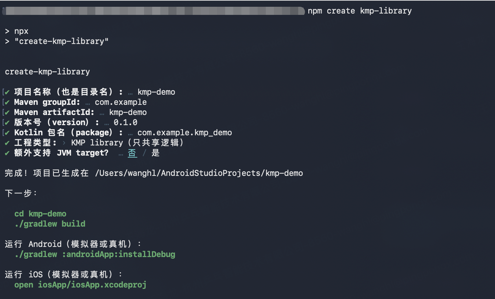

# create-kmp-library

通过 `npm create kmp-library` 快速创建 Kotlin Multiplatform library 工程（支持 KMP / CMP），并默认包含可运行的 Android / iOS 宿主 App。

## 效果



## 使用方式
```sh
npm create kmp-library
```

## 环境要求

- Node.js >= 18
- Xcode >= 16（仅 Apple Silicon）
